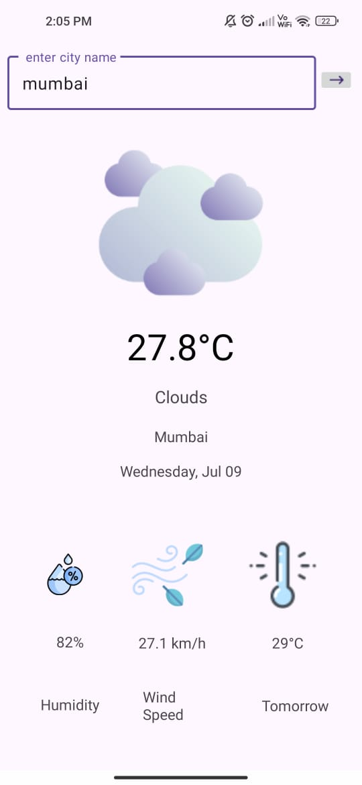

# 🌦️ Weather App

An elegant Android weather application that fetches **real-time weather data** and predicts **tomorrow's temperature** using a linear regression model — all wrapped in a modern Material Design UI.

---

## 🚀 Features

- 🔍 Search weather by city name
- 📍 Optional geolocation-based weather fetch
- 🌡️ Displays temperature, weather conditions, humidity, and wind speed
- 📈 Predicts tomorrow’s temperature using a trained regression formula
- 🎨 Beautiful UI with weather-based icons (sunny, cloudy, rainy, etc.)

---

## 🧠 Prediction Model

Uses a **linear regression equation** trained on historical weather data:


You can customize this formula or update the model as needed.

---

## 🖥️ Screenshots

|  |

---

## 🛠️ Tech Stack

| Tool | Description |
|------|-------------|
| `Java` | Primary language |
| `XML` | UI layouts with ConstraintLayout |
| `OkHttp` | For network calls |
| `OpenWeatherMap API` | Weather data (can be replaced with Visual Crossing / WeatherAPI) |
| `Material Components` | Beautiful modern UI |
| `ML Model` | Custom regression-based logic |

---

## 📦 Installation Guide

### 1. Clone the repository

```bash
git clone https://github.com/RohitDahara/WeatherApp.git
cd WeatherApp
